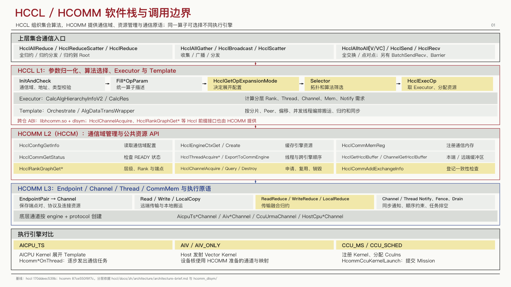
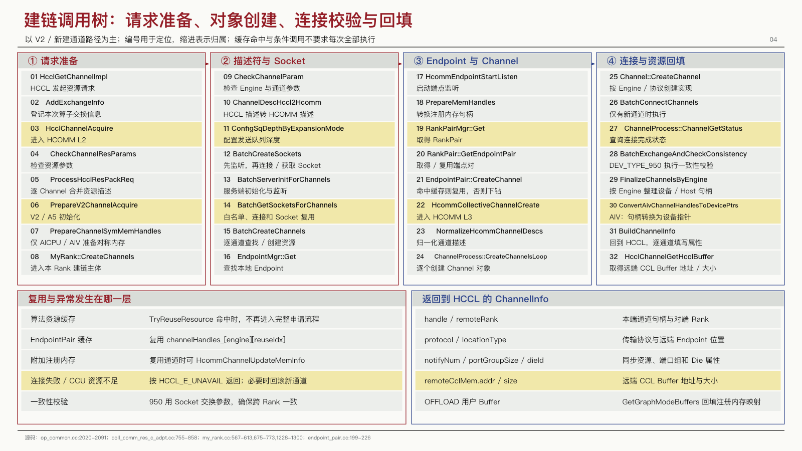
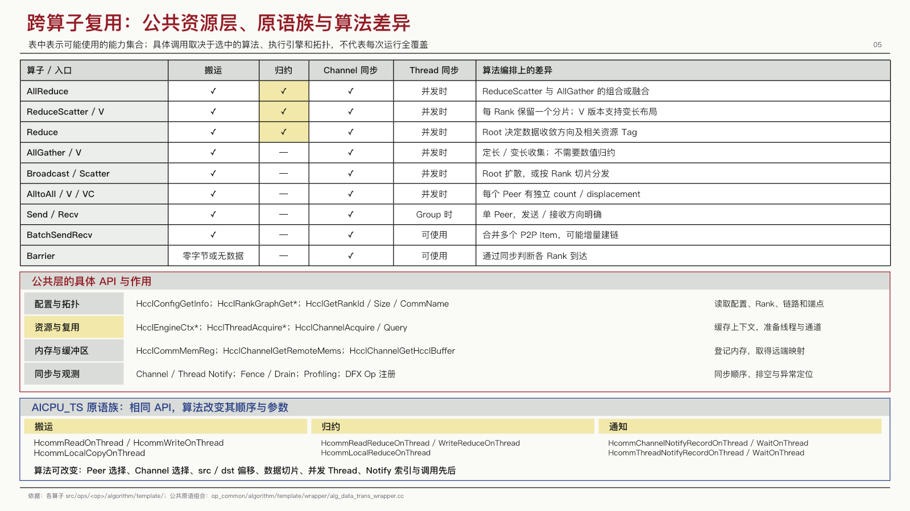
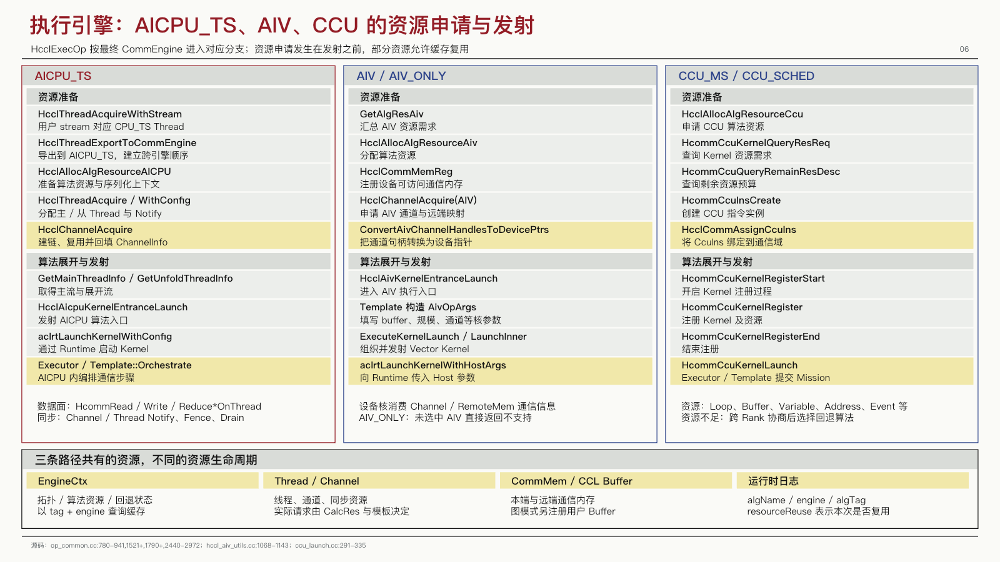

# 紧凑技术汇报 · Dense Tech Brief

面向架构评审、源码调用链和工程汇报的高信息密度 PPT 风格技能。重点是把关系讲清楚：紧凑条目、细线分组、函数与中文释义相邻，长说明放进讲解备注。

现在包含两种可独立使用的 Skill：

| Skill | 用途 | 入口 |
|---|---|---|
| `artifact-template-dense-tech-brief` | 使用保留的 PPT 模板、视觉参数与布局 | [根目录 SKILL.md](SKILL.md) |
| `technical-flow-brief` | 从技术证据组织总览、阶段流程、API 释义与测试矩阵 | [新增 Skill](skills/technical-flow-brief/SKILL.md) |

新版方法以“总览 → 阶段细节 → 测试总表”为默认结构。流程按阶段与责任层组织，避免绕全页连线；API 附中文作用；多个算子共用框架时，按真正有差异的 Engine/后端比较。全部共用项排在前，再放部分共用、专用和特殊分支。

`✓` 只表示条件路径涉及，不是每次必调。创建、版本、兼容等条件直接写中文，不使用 `✓冷` 等复合符号。证据不足写“待核”，不擅自打勾或划横线。

## 本次 PPT 归档

[HCCL / HCOMM PPT 归档](presentations/hccl-hcomm/README.md)收录本轮已交付的 56 份 PPT：最终版置顶，其余 55 份放在 `history/`。最终版为 **[FINAL · 流程与 Engine API 测试总表 r2（23 页）](presentations/hccl-hcomm/FINAL_HCOMM_流程与Engine_API测试总表_r2.pptx)**。

历史版仅用于回溯，技术结论优先参考最终版及其适用范围。归档不包含用户上传的参考照片，也不改变 Skill 的默认参考模板。



## 风格约定

- 红色标题、浅灰结构条、白色表格与少量淡黄重点；层次用位置、标签和细边界区分，不默认增加蓝/青/绿配色。
- 以 1280 × 720 为排版基准，同组条目约 2 px 间距，相关区块约 8–10 px 间距。
- 函数名与含义紧邻，输入、输出和分支条件放在对应位置，不额外堆叠解释侧栏。
- 用分层软件栈、调用树、原生矩阵、并列执行路径和参数流承载信息，不固定页数或列数。
- 总览只放主干交接，细节沿同名阶段展开；获取、创建、交换描述、传输数据与等待完成分别讲清。
- 不把互斥、缓存命中、兼容或回退路径误画成必经串行调用；关系需要来源证据。
- 保留可编辑 PPTX；备注承载长函数全称、详细释义、来源与讲解顺序。

密度来自有效信息和紧凑排版，不来自缩小字号或填充无关内容。

## 安装

将仓库克隆到 Codex 的个人技能目录。目标目录应不存在；若已有同名技能，先检查已有内容，不要直接覆盖。

```bash
git clone https://github.com/zstar1003/artifact-template-dense-tech-brief.git "${CODEX_HOME:-$HOME/.codex}/skills/artifact-template-dense-tech-brief"
```

若还需要独立的流程讲解 Skill，可将已克隆仓库里的 `skills/technical-flow-brief` 整个目录复制到个人技能目录。先确认目标目录不存在，已有版本应比较后更新，不直接覆盖：

```bash
cp -R "${CODEX_HOME:-$HOME/.codex}/skills/artifact-template-dense-tech-brief/skills/technical-flow-brief" "${CODEX_HOME:-$HOME/.codex}/skills/technical-flow-brief"
```

## 使用

在支持技能的 Codex 环境中调用：

```text
使用 $artifact-template-dense-tech-brief，基于提供的源码分析材料，
制作一份技术汇报 PPT：第一页总览跨层流程，后页按阶段展开。
每个 API 标明中文作用和调用条件，最后按执行路径列测试表，
共用接口在前、专用和特殊分支在后，详细释义及依据写入备注。
```

独立使用新 Skill：

```text
使用 $technical-flow-brief，把提供的代码调用链讲清楚：
谁下发请求、每层调用哪些 API、资源怎样准备和交换、数据怎样执行，
再区分不同后端的共用与专用接口，给出测试检查点。
```

这是风格与参考模板，不是独立的 PPT 生成器。PPTX 的导入、生成、渲染和检查交由当前环境中的 Presentations 技能及其运行时完成。`scripts/compact-layout.mjs` 是可选辅助模块，接收已有的 slide 对象，不安装依赖、不获取资料，也不单独导出文件。

默认中文字体为 PingFang SC；其他平台应选用已安装的中文字体并重新检查换行和溢出。

## 文件结构

```text
SKILL.md                         技能入口与使用规则
artifact-template.json           模板类型与参考资源路径
agents/openai.yaml               名称、默认提示词和预览配置
references/design-system.md      配色、字号、间距和视觉检查标准
references/layout-recipes.md     页面组合方式与参考坐标
references/review-checklist.md   流程、矩阵、视觉和发布检查
scripts/compact-layout.mjs       可选的排版辅助函数
assets/reference.pptx            完整 7 页可编辑参考，含讲解备注
assets/preview.png               首屏参考
assets/layouts/                  调用树、能力矩阵和执行路径参考
skills/technical-flow-brief/     独立流程讲解 Skill，含矩阵校验器与虚构示例
presentations/hccl-hcomm/         本轮 PPT 归档，含 FINAL 最终版与历史版本
```

新 Skill 的矩阵校验器使用 Node.js 内置模块，无第三方依赖：

```bash
node skills/technical-flow-brief/scripts/test-api-matrix.mjs
node skills/technical-flow-brief/scripts/api-matrix.mjs skills/technical-flow-brief/assets/matrix-example.json
```

它检查证据字段、覆盖状态、条件和排序，不验证源码事实，也不生成或上传 PPT。样例中的 `Example*` API 与 `mock/*.cc` 全部虚构，只用于理解格式。

## 版式示例

### 调用树与条件关系



### 能力矩阵与 API 释义



### 并列执行路径



## 参考内容的边界

保留的 HCCL / HCOMM PPT 是本风格的版式样例，分析来源为公开的 [HCCL](https://gitcode.com/cann/hccl) 与 [HCOMM](https://gitcode.com/cann/hcomm) 仓库。参考页中的版本、函数和源码位置只对应当时的分析，不应直接用作其他版本或其他主题的事实依据。

换主题时保留视觉组织方式，替换业务内容与来源；不固定为参考文件的 7 页，也不复制原主题的结论。此技能并非上述项目的官方模板。

历史模板参考文件保留不变，新版讲解和配色规则以 Skill 文本为准。Skill 方法包包含抽象规则、通用校验代码与虚构样例；经用户授权公开的本轮技术汇报 PPT 单独放在 `presentations/hccl-hcomm/`。两者均不包含用户参考照片或原照裁切，公开副本不保留本机绝对路径。
